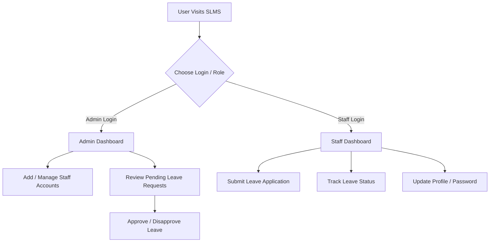

# 🏖️ Staff Leave Management System (SLMS)

A modern, full-stack **Django-based Staff Leave Management System** designed to streamline leave application, approval workflows, and staff administration in an organization.

---

## 📖 Table of Contents
- [Overview](#overview)
- [Key Features](#key-features)
- [Technology Stack](#technology-stack)
- [Project Architecture & Directory Structure](#project-architecture--directory-structure)
- [System Roles & Workflow](#system-roles--workflow)
- [Installation & Setup Guide](#installation--setup-guide)
- [Usage Instructions](#usage-instructions)
- [Troubleshooting](#troubleshooting)
- [License](#license)

---

## 🌟 Overview

The **Staff Leave Management System (SLMS)** is designed to simplify human resource leave tracking. It replaces manual paper-based leave requests with an automated digital workflow. It features role-based authorization for **Admins** and **Staff members**, complete with email authentication, custom profile pictures, and real-time status tracking.

---

## ✨ Key Features

### 🔐 Authentication & Security
- **Email-Based Login**: Custom authentication backend (`EmailBackEnd`) allowing users to authenticate seamlessly using their email address instead of traditional usernames.
- **Role-Based Access Control**: Strict permissions segregating Admin and Staff functionalities.
- **Profile & Security Management**: Password updating and profile picture customization.

### 👑 Admin Module
- **Interactive Dashboard**: Quick view of system stats (total staff members and leave requests).
- **Staff Management (CRUD)**: Create, view, update, and delete staff accounts.
- **Leave Approval System**: Review staff leave requests with standard one-click **Approve** or **Disapprove** actions.

### 👨‍💼 Staff Module
- **Leave Application**: Easy form submission for leave requests specifying leave type, start/end dates, and detailed reasons.
- **Leave Status Tracking**: Dedicated dashboard showing live status updates (**Pending**, **Approved**, or **Disapproved**) for all requested leaves.

---

## 🛠️ Technology Stack

| Component | Technology |
| :--- | :--- |
| **Backend Framework** | Django 4.2+ (Python 3.8+) |
| **Database** | SQLite3 (Default relational database) |
| **Authentication** | Django AbstractUser with custom `EmailBackEnd` |
| **Frontend UI** | HTML5, CSS3, Bootstrap, FontAwesome, JavaScript |
| **Media Handling** | Pillow (Python Imaging Library) |

---

## 📁 Project Architecture & Directory Structure

```text
staffleave/
├── slms/                        # Primary Django Project Root
│   ├── manage.py                # Django project management CLI
│   ├── requirements.txt         # Project Python dependencies
│   ├── db.sqlite3               # Relational SQLite database
│   ├── install_and_run.bat      # One-click Windows setup & launcher script
│   ├── run_server.bat           # Server execution launcher script
│   ├── install_django.bat       # Dependency script for Django
│   ├── install_pillow.bat       # Dependency script for Pillow
│   ├── README.md                # Inner project README documentation
│   ├── RUN_INSTRUCTIONS.md      # Execution guide documentation
│   │
│   ├── slms/                    # Django Configuration Directory
│   │   ├── settings.py          # Application configurations & installed apps
│   │   ├── urls.py              # Central URL routing definitions
│   │   ├── views.py             # General views (Login, Profile, Logout)
│   │   ├── adminviews.py        # Admin panel controller logic
│   │   └── staffviews.py        # Staff panel controller logic
│   │
│   ├── slmsapp/                 # Core Django App Directory
│   │   ├── models.py            # CustomUser, Staff, and Staff_Leave models
│   │   └── EmailBackEnd.py      # Custom authentication backend
│   │
│   ├── templates/               # HTML template files
│   │   ├── admin/               # Admin views HTML templates
│   │   └── staff/               # Staff views HTML templates
│   │
│   ├── static/                  # Static assets (CSS, JS, Fonts, Images)
│   └── media/                   # Media folder for uploaded profile pictures
└── venv/                        # Python Virtual Environment
```

---

## 👥 System Roles & Workflow



1. **Admin (`user_type = 1`)**: Admin registers staff accounts. When a staff member applies for leave, the admin receives the request in the admin panel to either approve or reject it.
2. **Staff (`user_type = 2`)**: Logs into their account using their registered email and password. Staff members can submit leave applications and check real-time approval status.

---

## ⚡ Installation & Setup Guide

### Option 1: One-Click Windows Automated Setup (Recommended)
If you are on Windows, you can simply run the automated batch setup script inside the `slms/` folder:
```cmd
cd slms
install_and_run.bat
```
This script automatically detects Python, installs dependencies (`Django` & `Pillow`), runs database migrations, prompts for superuser creation if missing, and launches the server.

---

### Option 2: Manual Installation (Cross-Platform)

#### 1. Navigate to the project directory
```bash
cd slms
```

#### 2. Create and activate a Virtual Environment
- **Windows**:
  ```cmd
  python -m venv venv
  venv\Scripts\activate
  ```
- **macOS / Linux**:
  ```bash
  python3 -m venv venv
  source venv/bin/activate
  ```

#### 3. Install project dependencies
```bash
pip install -r requirements.txt
```
*Alternatively:* `pip install Django==4.2 Pillow`

#### 4. Apply Database Migrations
```bash
python manage.py migrate
```

#### 5. Create Superuser (Admin) Account
```bash
python manage.py createsuperuser
```
*Note: Set an active email address when creating the superuser as login relies on email authentication.*

#### 6. Launch the Development Server
```bash
python manage.py runserver
```
Open your web browser and navigate to: `http://127.0.0.1:8000/`

---

## 🚀 Usage Instructions

1. **Landing & Login**:
   - Access `http://127.0.0.1:8000/` and navigate to `http://127.0.0.1:8000/Login`.
   - Log in using your registered Email and Password.

2. **Admin Panel Features**:
   - **Add Staff**: Navigate to `Admin -> Staff -> Add` to register a new staff member.
   - **Manage Staff**: View, update, or delete existing staff records.
   - **Leave Approval**: Go to `Admin -> Leave View` to review pending requests and click **Approve** or **Disapprove**.

3. **Staff Panel Features**:
   - **Apply Leave**: Go to `Staff -> Apply Leave` and select leave type, date range, and message reason.
   - **Leave History**: Check `Staff -> Leave View` to monitor whether applied leaves were Approved (`status = 1`), Rejected (`status = 2`), or are still Pending (`status = 0`).

---

## ❓ Troubleshooting

- **Media/Profile Pictures Not Displaying**:
  Verify that the `media` directory exists in `slms/` and that `MEDIA_URL` and `MEDIA_ROOT` are correctly configured in `slms/settings.py`.
- **Login Failure**:
  Ensure you are entering the user's registered **Email** address (not username), as authentication is handled by the custom `EmailBackEnd`.
- **Database Reset**:
  If you ever need a clean database state, delete `db.sqlite3`, run `python manage.py migrate`, and recreate your superuser.

---

## 📜 License

This project is open-source and intended for educational and managerial purposes.
